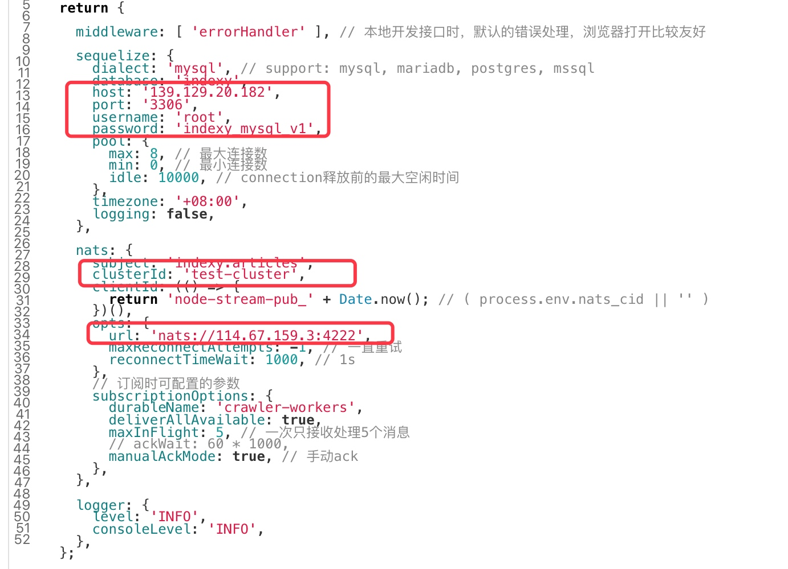
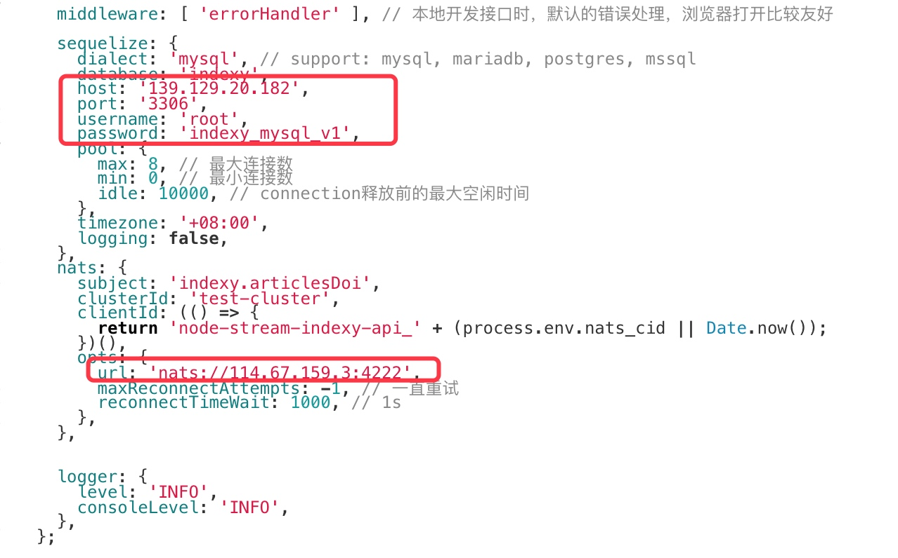
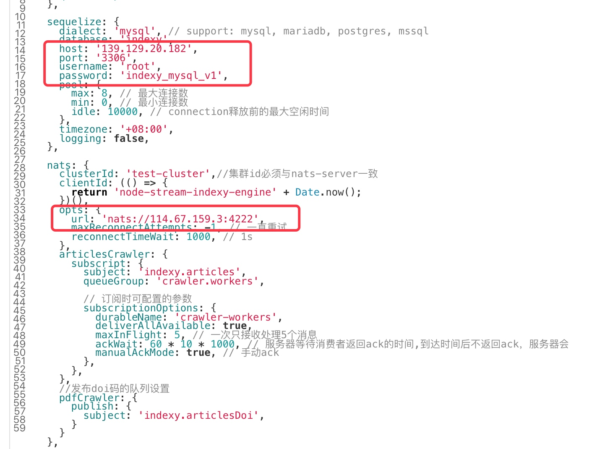
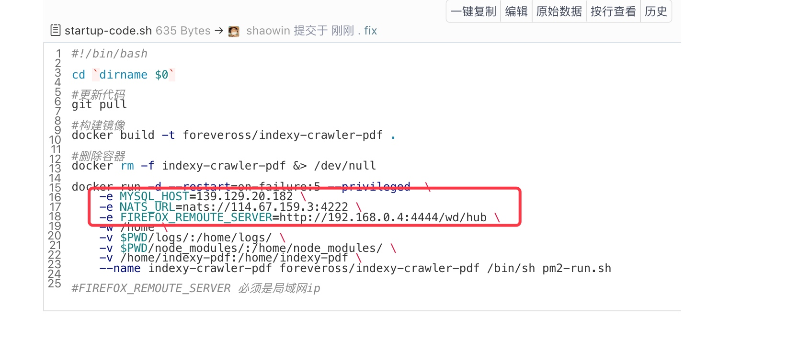

# 智能论文系统部署手册

## 部署规划

 服务名称|描述| 代码仓库|服务器|部署目录
---------- | --------|-----|-----|-----|
indexy-mysql|智能论文系统数据库|https://gitee.com/ai-pager/indexy-mysql|139.129.20.182|/home/ai-pager/indexy-mysql
indexy-crawler-api|智能论文后台管理系统|https://gitee.com/ai-pager/pager-crawler|139.129.20.182|/home/ai-pager/indexy-crawler-api
indexy-api|智能论文app端|https://gitee.com/ai-pager/indexy-api|139.129.20.182|/home/ai-pager/indexy-api
indexy-crawler-engine|智能论文文章爬虫引擎|https://gitee.com/ai-pager/indexy-crawler|112.74.93.133|/root/indexy-crawler-engine
indexy-crawler-pdf|智能论文文章PDF爬虫|https://gitee.com/ai-pager/indexy-crawler-pdf|139.129.20.182|/home/ai-pager/indexy-crawler-pdf
NATS-Stream-Server|轻量级消息队列|https://gitee.com/ai-pager/NATS-Stream-Server|114.67.159.3|/home/ai-pager/indexy-api

##  indexy-mysql

- 克隆项目

```
$ git clone https://gitee.com/ai-pager/indexy-mysql
```

- 启动mysql


```
$ cd {your_project}
$ ./start-mysql-single.sh
``` 

## NATS-Stream-Server

- 克隆项目

```
$ git clone https://gitee.com/ai-pager/NATS-Stream-Server
```

- 修改startup.sh配置文件

```
$ cd {your_project}
$ vi startup.sh

--cluster_id=test-cluster
```
ps:cluster_id为nats-server集群id,后面应用的连接配置必须与上面一致

- 启动应用


```
$ ./startup.sh
```

## indexy-crawler-web(后台管理-web)

indexy-crawler-web为后台管理系统web端，目前的部署方式是把该工程打包成静态文件，然后放在indexy-crawler-api的pubilc静态文件目录：

- 克隆项目

```
$ git clone https://gitee.com/ai-pager/indexy-web
```

- 打包静态文件

```
$ cd {your_project}
$ ./build.sh
```

- 更新web

复制dist目录下的文件到indexy-crawler-api的app/public目录，然后更新indexy-crawler-api即可

##  indexy-crawler-api（后台管理-api）

- 克隆项目

```
$ git clone https://gitee.com/ai-pager/pager-crawler
```

- 修改config.prod.js配置文件

```
$ cd {your_project}
$ vi config/config.prod.js
```

ps:主要修改MySQL数据库的地址以及nats消息队列的地址

- 启动应用


```
$ ./startup-code.sh
```

## indexy-webApp(H5)

indexy-webApp为H5端app，目前的部署方式是把该工程打包成静态文件，然后放在indexy-api的pubilc静态文件目录：

- 克隆项目

```
$ git clone https://gitee.com/ai-pager/indexy-webApp
```

- 打包静态文件

```
$ cd {your_project}
$ ./build.sh
```

- 更新web

复制dist目录下的文件到indexy-api的app/public目录，然后更新indexy-api即可


## indexy-api

- 克隆项目

```
$ git clone https://gitee.com/ai-pager/indexy-api
```

- 修改config.prod.js配置文件

```
$ cd {your_project}
$ vi config/config.prod.js
```


ps:主要修改MySQL数据库的地址以及nats消息队列的地址

- 启动应用


```
$ ./startup-code.sh
```


## indexy-crawler-engine

- 克隆项目

```
$ git clone https://gitee.com/ai-pager/indexy-crawler
```

- 修改config.production.js配置文件

```
$ cd {your_project}
$ vi config/config.production.js
```



ps:主要修改MySQL数据库的地址以及nats消息队列的地址

- 启动应用


```
$ ./startup-code.sh
```


## indexy-crawler-pdf

- 克隆项目

```
$ git clone https://gitee.com/ai-pager/indexy-crawler-pdf
```

- 启动selenium-firefox


```
$ ./startup-selenium-standalone-firefox.sh
```

- 修改startup-code.sh配置文件

```
$ cd {your_project}
$ vi startup-code.sh

```



ps:主要修改MySQL数据库的地址、nats消息队列的地址以及selenium-firefox的地址，FIREFOX_REMOUTE_SERVER为selenium-firefox启动的ip,必须是局域网ip


- 启动pdf爬虫

```
$ ./startup-code.sh
```


